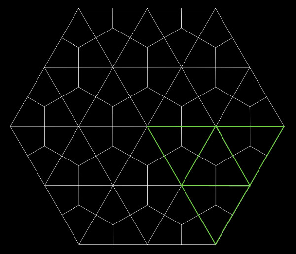
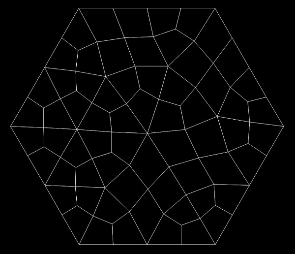

# Organic Quads

Helper class to create hexagonal shapes filled with organic looking quads.

## Usage:

```js 

import OrganicQuads from "@fforw/organic-quads";

const og = new OrganicQuads(config);

```                                     

## Configuration


```js 

const DEFAULT_CONFIG = {
    // coordinate width
    width: 0,
    // coordinate height
    height: 0,
    // number of rings in the hexagon / number of base intersections of hexaxgon
    numberOfRings: 5,
    // how many percent of the edges shall we attempt to remove?
    removeEdges: 50,
    // if true, the graph will be layouted a bit with every render. If false, the graph relaxation happens at creation
    animatedEasing: true,
};

```                                     

The graph will be centered in the window given by width/height and scaled so that it fits the smaller dimension height.

### Number of Rings




The diagram shows a graph with "removeEdges" set to 0 and "numberOfRings" set to 1.

I marked triangles of the initial ring and the one additional ring in the first sector of the hexagon.

Each base face is divided once to have only quads. Every triange here is subdivided into 3 quads.

Every removed edge turns two base triangles into one base quad which is then subdivided into 4 quads.



Relaxing the graph after removing the edges gives it the organic shape.

[Live interactive demo](https://fforw.github.io/funky-quads/)
  

## Array Structs

The code within the lib using large typed arrays with sub-structs in them to a) allocate less objects, have more data in a
CPU cache friendly linear fashion and b) have fast access to that data by being able to use type array access semantics 
instead of js object semantics 

This runs somewhat against code readability. I replaced the initial numeric code with symbols now, so it shouldn't be 
that bad ;)

They're const but writing them UPPERCASE wrecks the readability a lot I think, so I chose a rather funky underscore
 and hypen naming to group and disambiguate them.
 

Here's some further documentation of the formats

### Faces

Data for the first phase. A List of faces that are either triangles, quads or later deleted faced

It starts with 4 coordinate pairs 

Offset| Name        |  Description
------|-------------|-----------------
  0   | f_x0          | 
  1   | f_y0          | 
  2   | f_x1          | 
  3   | f_y1          |
  4   | f_x2          |
  5   | f_y2          |
  6   | f_x3          |
  7   | f_y3          |
  8   | f_count       | Vertex count for the face (3, 4 or 0 for deleted) 
  9   | f_outmostEdge | Edge of the face that is part of the outside border of the big hexagon. -1 if not at the edge.
  
**Size: 10**

### Node Graph

After the face structs have been processed by removing random edges, each extending one triangle to a quad and deleting
the other, it is transformed into a node graph structure for relaxation purposes

 
Offset| Name        |  Description
------|-------------|-----------------
  0   | g_x           | x-coordinate of the node   
  1   | g_y           | y-coordinate of the node   
  2   | g_isEdge      | 1 if the node is on the edge of the big hexagon, 0 if not
  3   | g_count       | Number of connections to other nodes
  4   | g_edge0       | 
  5   | g_edge1       | 
  6   | g_edge2       |
  7   | g_edge3       |
  8   | g_edge4       |
  9   | g_edge5       |
  
**Size: 10**
     
 The edge0 ... edge5 values represent the connections to the other nodes in the graph. The values are a direct index
 to the graph structure.
 
 The maximum number of neighbors a node can have in our hexagon based graph is *6*. It's the node at the very
 center of the graph (if none of the surrounding triangles have been removed).
 
 
```js 
    
    const n1 = nodes[n0 + 4];
    const y = nodes[n1 + 1];
```                                     
 
 Here we access the first edge of a node `n0` which we called `n1` and then access the y value of it.
 
 ### Tiles
 
 After the organic quads are all relaxed and everything is done, we create the final data-structure which
 is a quad-centric view on the nodes graph
 
Offset| Name        |  Description
------|-------------|-----------------
  0   | t_n0          | first node of the tile   
  1   | t_n1          | second node of the tile   
  2   | t_n2          | third node of the tile   
  3   | t_n3          | fourth node of the tile   
  4   | t_cx          | X-coordinate of the quad centroid   
  5   | t_cy          | y-coordinate of the quad centroid   
  6   | t_count       | Connections to other tiles   
  6   | t_isEdge      | 1 if one of the edges of the title lies on the outer edge of the big hexagon   
  7   | t_tile0       |   
  8   | t_tile1       |   
  9   | t_tile2       |   
  10  | t_tile3       |   

Size: 12
